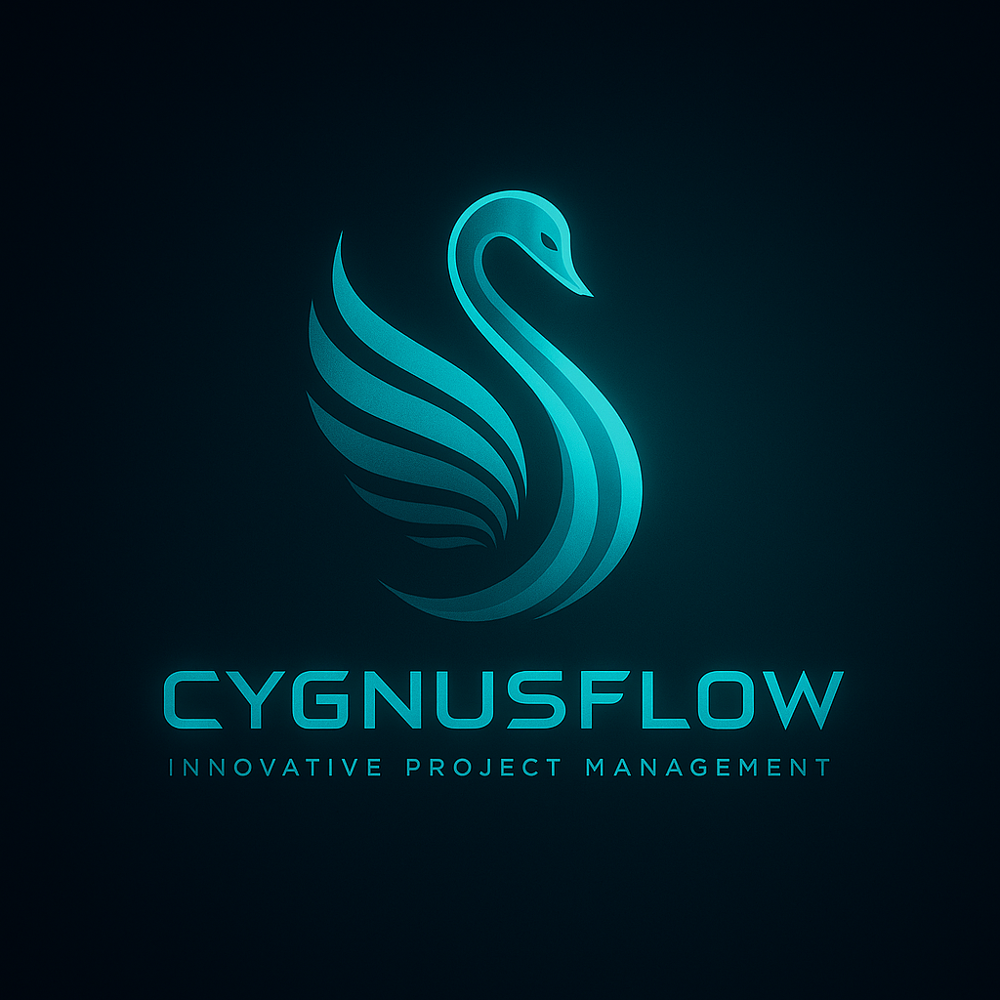

[![Contributors][contributors-shield]][contributors-url]
[![Forks][forks-shield]][forks-url]
[![Stargazers][stars-shield]][stars-url]
[![Issues][issues-shield]][issues-url]
[![MIT License][license-shield]][license-url]
[![LinkedIn][linkedin-shield]][linkedin-url]

  

<h1 align="center">CygnusFlow</h1>
<h4 align="center"><em>Fluxo inteligente, gestão eficiente</em></h4>

<!-- ABOUT THE PROJECT -->

## Sobre o Projeto

O **CygnusFlow** é uma plataforma modular de gestão de projetos voltada para equipes técnicas, líderes de produto e stakeholders. Ele permite organizar e acompanhar o ciclo de vida completo de um projeto — do planejamento à execução — com foco em **transparência, produtividade e controle**.

O projeto segue os princípios da **Clean Architecture**, sendo adaptável para uso em ambientes desktop (via WinForms) e web (via API + frontend React).

## 📐 Arquitetura

O backend foi desenvolvido em **.NET 9** com separação clara por camadas:

Cada camada é isolada e respeita o princípio de inversão de dependência, tornando o projeto altamente testável, escalável e sustentável.

---

## 🧠 Funcionalidades

- 📋 Cadastro e edição de projetos e tarefas
- 🧑‍💼 Controle de acesso por papéis (Admin, P.O., Dev, Viewer)
- 📅 Gantt Chart com comparativos (Planejado vs Realizado)
- 📊 Relatórios gerenciais e analíticos
- 🔔 Notificações de prazos
- 📈 Dashboard com indicadores (burndown, atrasos, confiabilidade)
- 💬 Histórico e anotações por projeto
- 📤 Exportação para Excel/PDF
- 🔐 Autenticação JWT
- 💾 Suporte a múltiplos bancos: SQL Server, PostgreSQL, SQLite

---

## 🧪 Testes

O projeto contém testes unitários organizados por camada:

- `CygnusFlow.Domain`: Validações e regras puras
- `CygnusFlow.Application`: Casos de uso, regras de fluxo
- `CygnusFlow.Infrastructure`: Repositórios mockados
- Frameworks: **xUnit**, **Moq**, **FluentAssertions**

---

## 🛡️ Segurança

- Autenticação com JWT
- Armazenamento seguro de senhas (hash + salt)
- Proteções contra SQL Injection e XSS
- Comunicação segura via TLS
- Controle de acesso por perfil e escopo

---

## 📈 Roadmap (Resumo)

| Fase | Objetivo                                     | Status   |
|------|----------------------------------------------|----------|
| 1    | MVP Desktop com WinForms                     | ✅ Em andamento |
| 2    | Módulo de permissões e relatórios            | 🔜 Em planejamento |
| 3    | Dashboard completo e indicadores gerenciais  | 🔜 Futuro |
| 4    | Criação da API e frontend em React           | 🔜 Futuro |

(<a href="#top">back to top</a>)

# Tecnologias

### Linguagens

### Frameworks, Platforms and Libraries

### Banco de Dados

### Designer

### Testes

<!-- CONTACT -->

## Contatos
---

Marcos Araujo - [@linkedIn](https://www.linkedin.com/in/marcosaraujosouza/) - marcos.araso@hotmail.com

Project Link: [Projeto_Base_Typescript](https://github.com/marcosaraujo-dev/Projeto_Base_Typescript)

(<a href="#top">back to top</a>)

<!-- ACKNOWLEDGMENTS -->

## Agradecimentos

-   [XXXXXXX](https://XXXXXX/)

(<a href="#top">back to top</a>)

<!-- MARKDOWN LINKS & IMAGES -->
<!-- https://www.markdownguide.org/basic-syntax/#reference-style-links -->

[contributors-shield]: https://img.shields.io/github/contributors/marcosaraujo-dev/CygnusFlow.svg?style=for-the-badge
[contributors-url]: https://github.com/marcosaraujo-dev/CygnusFlow/graphs/contributors
[forks-shield]: https://img.shields.io/github/forks/marcosaraujo-dev/CygnusFlow.svg?style=for-the-badge
[forks-url]: https://github.com/marcosaraujo-dev/CygnusFlow/network/members
[stars-shield]: https://img.shields.io/github/stars/marcosaraujo-dev/CygnusFlow.svg?style=for-the-badge
[stars-url]: https://github.com/marcosaraujo-dev/CygnusFlow/stargazers
[issues-shield]: https://img.shields.io/github/issues/marcosaraujo-dev/CygnusFlow.svg?style=for-the-badge
[issues-url]: https://github.com/marcosaraujo-dev/CygnusFlow/issues
[license-shield]: https://img.shields.io/github/license/marcosaraujo-dev/CygnusFlow.svg?style=for-the-badge
[license-url]: https://github.com/marcosaraujo-dev/CygnusFlow/blob/master/LICENSE.txt
[linkedin-shield]: https://img.shields.io/badge/-LinkedIn-black.svg?style=for-the-badge&logo=linkedin&colorB=555
[linkedin-url]: https://www.linkedin.com/in/marcosaraujosouza/
